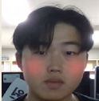

알겠습니다! 요청하신 대로 프로젝트 제목부터 시작하여 각 부분을 차례대로 자세히 설명하겠습니다.

---

### 프로젝트 제목: **실시간 얼굴 필터링 애플리케이션**

### 1. 프로젝트 목적
이 프로젝트는 **실시간 얼굴 필터링** 애플리케이션으로, 사용자의 얼굴을 웹캠으로 실시간으로 추적하고, 그 위에 다양한 필터를 적용하여 사용자에게 재미있고 실용적인 기능을 제공합니다. 사용자는 이 애플리케이션을 통해 **선글라스, 귀, 마스크** 등의 필터를 얼굴에 자연스럽게 적용할 수 있으며, 이를 통해 새로운 방식으로 자신의 모습을 꾸미고 즐길 수 있습니다.

### 2. 사용된 기술
이 프로젝트는 **OpenCV**, **MediaPipe**, **Numpy**와 같은 다양한 기술을 활용하여 얼굴 인식 및 필터 적용을 구현했습니다. 각 기술을 선택한 이유는 다음과 같습니다:

- #### 2.1 **OpenCV**
  **OpenCV**는 이미지 및 영상 처리에 널리 사용되는 라이브러리입니다. 이 프로젝트에서는 **웹캠 영상 캡처**, **영상 처리**, **필터 적용** 등을 처리하는 데 사용되었습니다. OpenCV는 실시간 영상 처리에 매우 효율적이고, 다양한 이미지 변환 및 필터링 기능을 제공하기 때문에 선택되었습니다.

- #### 2.2 **MediaPipe**
  **MediaPipe**는 **구글**에서 개발한 **컴퓨터 비전** 라이브러리로, 얼굴 인식 및 랜드마크 추출에 특화되어 있습니다. 이 프로젝트에서는 **FaceMesh**를 사용하여 실시간으로 얼굴의 랜드마크를 추출하고, 이 정보를 바탕으로 얼굴에 필터를 자연스럽게 적용했습니다. MediaPipe는 높은 정확도와 성능을 제공하기 때문에 이 프로젝트에서 얼굴 인식에 적합한 라이브러리로 선택되었습니다.

- #### 2.3 **Numpy**
  **Numpy**는 배열 및 행렬 연산을 효율적으로 처리하는 파이썬 라이브러리입니다. 얼굴 필터를 적용할 때 **회전**, **크기 조정** 등 수학적인 변환이 필요하고, 이러한 연산을 효율적으로 처리하기 위해 **Numpy**를 사용했습니다.

- #### 2.4 **Pyside**
  **PySide**는 **Qt** 프레임워크를 Python에서 사용할 수 있도록 만든 라이브러리로, **GUI 애플리케이션**을 만들 때 강력한 도구를 제공합니다. Qt는 **크로스 플랫폼** 개발을 지원하며, 복잡한 GUI를 손쉽게 구축할 수 있도록 다양한 위젯을 제공합니다.

---

### 3. GUI 설명
이 프로젝트의 GUI는 사용자가 실시간으로 얼굴 필터를 확인하고 선택할 수 있도록 구성되었습니다. 웹캠에서 촬영한 영상을 화면에 출력하고, 사용자가 키보드를 통해 필터 모드를 전환할 수 있도록 하였습니다.
<p align = "center">

</p>

- #### 3.1 **필터 모드 전환**
  프로그램은 **4가지 모드**로 구성되어 있습니다:
  - **No Filter**: 필터가 적용되지 않은 원본 영상
  - **Face Detection**: 얼굴을 인식하는 모드
  - **Face Mesh**: 얼굴 랜드마크를 그리는 모드
  - **Replace Background**: 얼굴을 검은색으로 만들고 배경을 다른 이미지로 교체하는 모드

  사용자는 **Q 키**를 눌러 모드를 변경할 수 있으며, **ESC 키**를 눌러 프로그램을 종료할 수 있습니다.

아래는 주어진 양식에 맞춰서 **선글라스**, **토끼 귀**, **마스크**, **블러 처리** 필터에 대한 설명과 코드, 추가 설명을 포함하여 작성한 내용입니다.

---

### 4. 필터 적용 (선글라스, 토끼 귀, 마스크, 블러 처리)

이 프로젝트에서는 **선글라스**, **토끼 귀**, **마스크** 필터 외에도 **배경 교체**와 같은 다양한 기능을 제공합니다. 아래에서 각 필터의 적용 방법을 자세히 설명하겠습니다.

<p align="center">
  
</p>


### 4.1 **선글라스 필터**
**선글라스 필터**는 사용자의 얼굴에 자연스럽게 선글라스를 추가하는 기능입니다. 이 필터는 **두 눈의 중심**을 기준으로 선글라스를 위치시키고, **회전 각도**를 계산하여 선글라스가 정확하게 눈에 맞게 배치됩니다. 또한, 선글라스 이미지는 투명 PNG 형식으로 사용되어 배경과 잘 결합됩니다.

- **눈의 위치**를 추적하고, 그에 맞춰 **회전** 및 **크기 조정**하여 선글라스를 적용합니다.

```python
def calculate_angle(landmarks, frame):
    left_eye = get_eye_center(landmarks, [33, 133], frame)
    right_eye = get_eye_center(landmarks, [362, 263], frame)

    dx = right_eye[0] - left_eye[0]
    dy = right_eye[1] - left_eye[1]
    angle = np.degrees(np.arctan2(dy, dx))  # 두 점 사이의 기울기를 계산
    return angle

def rotate_image(image, angle):
    (h, w) = image.shape[:2]
    center = (w // 2, h // 2)
    M = cv2.getRotationMatrix2D(center, angle, 1.0)  # 회전 행렬 생성
    rotated = cv2.warpAffine(image, M, (w, h), flags=cv2.INTER_CUBIC, borderMode=cv2.BORDER_REFLECT)  # 이미지 회전
    return rotated
```

### 선글라스 필터 적용 과정:
1. **각도 계산**: `calculate_angle` 함수는 얼굴의 기울기를 계산하여 선글라스가 기울어진 얼굴에 맞게 회전되도록 합니다. 이 함수는 **`arctan2(dy, dx)`**를 사용하여 두 점 사이의 기울기를 구하고, **`np.degrees`**를 사용해 라디안을 각도로 변환합니다.  
   - `arctan2(dy, dx)`는 두 점 사이의 각도를 계산하는 함수로, y축과 x축의 차이를 이용해 정확한 각도를 구합니다. 이는 **기울기**나 **방향**을 나타낼 때 유용하게 사용됩니다.
   - **`np.degrees`**는 라디안 값을 각도로 변환하는 함수로, `arctan2`의 결과를 사람 눈에 읽을 수 있는 각도로 변환합니다.

2. **선글라스 회전**: `rotate_image` 함수는 회전 행렬을 생성하여 선글라스를 얼굴 각도에 맞게 회전시킵니다.  
   - **`getRotationMatrix2D(center, angle, scale)`**: 이 함수는 이미지를 회전시키기 위한 회전 행렬을 생성합니다. 매개변수로는 회전의 중심, 회전 각도, 확대/축소 비율이 있습니다.
     - `center`: 이미지의 중심점으로, 이미지를 회전시킬 기준점이 됩니다.
     - `angle`: 회전할 각도입니다. 이는 `calculate_angle`에서 계산된 얼굴 기울기 각도입니다.
     - `scale`: 이미지를 확대/축소하는 비율인데, 여기서는 1로 설정하여 크기는 그대로 유지합니다.
   - **`cv2.warpAffine(image, M, (w, h), ...)`**: 회전 행렬 `M`을 이용해 이미지를 실제로 회전시키는 함수입니다. 이때, `INTER_CUBIC`은 고급 보간법을 사용하여 회전된 이미지의 품질을 높이고, `BORDER_REFLECT`는 이미지가 회전할 때 생기는 빈 공간을 가장자리의 색상으로 채우는 옵션입니다.

3. **눈의 위치 추적**: `get_eye_center` 함수로 두 눈의 중심 좌표를 얻고, 이를 기준으로 선글라스를 정확한 위치에 배치합니다.  
   - **`get_eye_center(landmarks, [33, 133], frame)`**는 얼굴 랜드마크에서 **왼쪽 눈**과 **오른쪽 눈**의 중심 좌표를 추출합니다. 이를 통해 두 눈 사이의 거리와 상대적인 위치를 계산하여 선글라스를 그 위치에 배치할 수 있습니다.

4. **크기 조정**: 눈 사이의 거리(`eye_distance`)에 맞춰 선글라스의 크기를 조정합니다.  
   - 선글라스의 크기를 **눈 사이의 거리**에 비례하여 설정합니다. 예를 들어, 눈 사이가 멀어지면 선글라스도 그에 맞춰 더 넓게 조정됩니다.

5. **합성**: `apply_image_on_face` 함수로 원본 이미지에 선글라스를 합성하여 적용합니다.  
   - 이 과정에서 선글라스는 **알파 채널(투명도)**을 기반으로 원본 이미지와 결합되어 자연스럽게 합성됩니다.
   - **`alpha_s`**: 선글라스의 투명도 정보. 선글라스 이미지의 알파 채널을 `255`로 나누어 0-1 범위로 변환합니다.
   - **`alpha_l`**: 배경 이미지의 투명도 값으로, `1.0 - alpha_s`를 사용하여 배경과 결합됩니다.
   - 두 이미지를 합성하는 과정에서 **`overlay_img[:, :, c] = alpha_s * overlay_rotated[:, :, c] + alpha_l * overlay_img[:, :, c]`**를 사용하여 각 채널(RGB)별로 두 이미지를 합성합니다.

```python
def apply_image_on_face(frame, sunglasses_resized, x, y):
    alpha_s = sunglasses_resized[:, :, 3] / 255.0  # 투명도 채널 추출
    alpha_l = 1.0 - alpha_s

    for c in range(0, 3):  # RGB 채널에 대해 알파 채널을 고려한 합성
        frame[y:y + sunglasses_resized.shape[0], x:x + sunglasses_resized.shape[1], c] = (
            alpha_s * sunglasses_resized[:, :, c] + alpha_l * frame[y:y + sunglasses_resized.shape[0], x:x + sunglasses_resized.shape[1], c]
        )

    return frame
```

---

### **선글라스 적용 과정**:
1. **각도 계산**: `arctan2`와 `np.degrees`를 사용해 두 눈의 위치로 얼굴 기울기 각도를 계산합니다.
2. **선글라스 회전**: `getRotationMatrix2D`로 회전 행렬을 만들고, `warpAffine`로 이미지를 회전시켜 얼굴 각도에 맞게 선글라스를 회전시킵니다.
3. **눈 위치 추적**: `get_eye_center`로 두 눈의 중심 좌표를 얻고, 선글라스를 그 위치에 배치합니다.
4. **크기 조정**: 눈 사이의 거리에 맞춰 선글라스를 조정하여 적절한 크기로 설정합니다.
5. **합성**: 투명 PNG 형식으로 선글라스를 원본 이미지에 합성하여 자연스럽게 적용합니다.

이렇게 각 단계에서 중요한 함수들과 그 기술적 요소들을 설명했습니다.

---

#### 4.2 **토끼 귀 필터**
**토끼 귀** 필터는 사용자의 머리 위에 귀 모양의 이미지를 추가하는 기능입니다. 이 필터의 동작 방식은 **얼굴의 크기와 위치**를 기반으로 귀 이미지가 자연스럽게 사용자 머리 위에 배치되도록 합니다.

<p align= "center">
  
</p>

물론입니다! 아래는 **토끼 귀 필터**에 대한 설명과 코드입니다. 양식에 맞춰서 상세히 설명하고, 주어진 코드와 함께 필터 적용 과정을 정리하였습니다.

---

#### 4.2 **토끼 귀 필터**

**토끼 귀 필터**는 사용자의 머리 위에 **귀 모양 이미지**를 추가하는 기능입니다. 이 필터는 사용자의 **얼굴 위치와 크기**를 기준으로 귀 이미지를 크기 조정하고, 얼굴의 상단에 귀 이미지를 정확히 배치하여 자연스러운 효과를 만듭니다. **`MediaPipe`**를 사용하여 얼굴의 위치를 추적하고, **귀 이미지의 크기**를 얼굴의 크기에 맞게 조정하는 방식으로 동작합니다.

**토끼 귀 필터 적용 과정**:
1. **얼굴의 상단 위치**를 추적하여 귀 이미지를 머리 위에 정확히 배치합니다.
2. **귀 이미지의 크기**는 사용자의 얼굴 크기에 맞춰 동적으로 조정됩니다.
3. **귀 이미지를 배치**하여 사용자의 머리 위에 자연스럽게 올려 놓습니다.

```python
def apply_rabbit_ears(frame, landmarks, rabbit_ears_image):
    # 얼굴의 상단 위치 계산
    face_top = landmarks[10]  # 얼굴 상단 랜드마크 (예시: 이마 위치)
    face_width = int(landmarks[234].x - landmarks[454].x)  # 얼굴 너비 계산
    
    # 귀 이미지를 얼굴 크기에 맞게 크기 조정
    resized_rabbit_ears = cv2.resize(rabbit_ears_image, (face_width, int(face_width * 0.5)))
    
    # 머리 위에 귀 이미지를 배치할 위치 계산
    x_offset = int(face_top.x * frame.shape[1] - resized_rabbit_ears.shape[1] / 2)
    y_offset = int(face_top.y * frame.shape[0] - resized_rabbit_ears.shape[0] / 2)
    
    # 귀 이미지를 원본 프레임에 합성하는 함수 호출
    frame_with_rabbit_ears = apply_image_on_face(frame, resized_rabbit_ears, x_offset, y_offset)
    
    return frame_with_rabbit_ears
```

**토끼 귀 필터 적용 과정**:
1. **얼굴의 상단 위치 추적**: `landmarks[10]`에서 얼굴의 상단(이마)을 추적하여 귀를 머리 위에 정확히 배치합니다.
2. **귀 이미지 크기 조정**: 얼굴의 너비를 기준으로 귀 이미지의 크기를 동적으로 조정합니다.
3. **귀 이미지 배치**: 계산된 위치에 귀 이미지를 배치하여 사용자의 머리 위에 자연스럽게 배치되도록 합니다.

---

#### 토끼 귀 필터 코드 설명

다음은 **토끼 귀** 이미지를 얼굴에 맞게 배치하는 코드입니다. `MediaPipe`에서 얼굴 랜드마크를 추적하여 **이마** 위치에 귀 이미지를 올려놓습니다. 귀 이미지는 **투명 PNG** 형식으로 처리되며, **알파 채널**을 사용해 얼굴 이미지와 합성됩니다.

```python
def overlay_rabbit_ears(frame, landmarks):
    rabbit_ear_img = cv2.imread(AssetPaths.FACE_RABBIT_EARS_PATH, cv2.IMREAD_UNCHANGED)
    if rabbit_ear_img is None:
        raise FileNotFoundError("rabbit_ear2.png 파일을 찾을 수 없습니다.")

    forehead_index = 10  # 이마 위치의 랜드마크 인덱스
    forehead_landmark = landmarks[forehead_index]

    h, w, _ = frame.shape
    forehead_x = int(forehead_landmark.x * w)
    forehead_y = int(forehead_landmark.y * h)

    ear_width, ear_height = rabbit_ear_img.shape[1], rabbit_ear_img.shape[0]
    x1, y2 = forehead_x - ear_width // 2, forehead_y
    x2, y1 = x1 + ear_width, y2 - ear_height

    # 화면 경계를 넘지 않도록 조정
    x1, y1 = max(0, x1), max(0, y1)
    x2, y2 = min(w, x2), min(h, y2)

    cropped_width = x2 - x1
    cropped_height = y2 - y1

    if cropped_width > 0 and cropped_height > 0:
        rabbit_ear_cropped = rabbit_ear_img[-cropped_height:, :cropped_width]
        alpha_s = rabbit_ear_cropped[:, :, 3] / 255.0  # 알파 채널
        alpha_l = 1.0 - alpha_s

        for c in range(3):  # BGR 채널에 대해 알파 채널을 적용
            frame[y1:y2, x1:x2, c] = (
                alpha_s * rabbit_ear_cropped[:, :, c] + alpha_l * frame[y1:y2, x1:x2, c]
            )
```

**토끼 귀 필터 적용 과정**:
1. **귀 이미지 로딩**: `cv2.imread()`로 귀 이미지를 로드합니다. 투명 배경을 지원하는 PNG 파일을 사용하여 귀 이미지를 로드합니다.
2. **얼굴 상단 위치 추적**: `landmarks[10]`을 사용하여 얼굴의 상단(이마)을 추적합니다.
3. **귀 이미지 배치**: 이마의 위치를 기준으로 귀 이미지를 **동적으로 크기 조정**하고, 적절한 위치에 배치하여 화면에 합성합니다.
4. **알파 채널을 통한 합성**: 귀 이미지의 알파 채널을 사용하여 원본 이미지에 귀 이미지를 자연스럽게 합성합니다. 알파 채널을 사용해 배경을 투명하게 유지하고 얼굴에 자연스럽게 귀를 추가합니다.

---

이와 같이 **토끼 귀 필터**는 얼굴 랜드마크를 기반으로 귀 이미지를 정확하게 배치하고, 이를 원본 이미지에 합성하여 **사용자의 얼굴에 귀를 추가하는** 기능을 제공합니다.

---

물론입니다! 아래는 **얼굴 홍조 (Blush)** 필터에 대한 설명과 함께 해당 코드가 포함된 예시입니다. 

---

#### 4.3 **얼굴 홍조 (Blush)**

**얼굴 홍조 필터**는 사용자의 얼굴에 **발그레한 효과**를 추가하는 기능입니다. 이 필터는 사용자의 **왼쪽과 오른쪽 뺨** 부위의 랜드마크를 기준으로, 해당 위치에 **붉은색의 원형 효과**를 적용하여 자연스러운 홍조 효과를 만들어냅니다. 이 과정은 **알파 채널을 이용한 블렌딩**과 **가우시안 블러** 처리를 통해 부드럽고 자연스러운 결과를 제공합니다.

<p align = "center">

</p>

**얼굴 홍조 적용 과정**:
1. **왼쪽과 오른쪽 뺨의 위치 추적**: `MediaPipe`에서 제공되는 얼굴 랜드마크를 사용하여 **왼쪽 뺨**(50번 인덱스)과 **오른쪽 뺨**(280번 인덱스) 위치를 추적합니다.
2. **발그레 효과 추가**: 추적된 뺨의 위치에 **붉은색 원형 영역**을 추가하고, 이를 **가우시안 블러**를 사용하여 자연스럽게 섞어줍니다.
3. **알파 채널을 이용한 블렌딩**: `cv2.addWeighted()` 함수를 사용하여 얼굴 원본 이미지에 홍조 효과를 자연스럽게 합성합니다.

```python
def add_blush(frame, landmarks):
    # 왼쪽과 오른쪽 뺨의 랜드마크 인덱스
    left_cheek_index = 50
    right_cheek_index = 280

    # 뺨의 랜드마크 좌표 추출
    left_cheek_landmark = landmarks[left_cheek_index]
    left_cheek_point = (
        int(left_cheek_landmark.x * frame.shape[1]),
        int(left_cheek_landmark.y * frame.shape[0]),
    )

    right_cheek_landmark = landmarks[right_cheek_index]
    right_cheek_point = (
        int(right_cheek_landmark.x * frame.shape[1]),
        int(right_cheek_landmark.y * frame.shape[0]),
    )

    # 발그레한 효과를 적용할 영역
    for point in [left_cheek_point, right_cheek_point]:
        overlay = np.zeros_like(frame)  # 해당 영역을 덮을 빈 이미지 생성
        alpha = 0.5  # 투명도 설정
        radius = 15  # 원의 반지름
        color = (0, 0, 255)  # 붉은색 (BGR)

        # 붉은 원형 영역 그리기
        cv2.circle(overlay, point, radius, color, -1)
        
        # 원형 영역에 가우시안 블러 적용
        blurred_overlay = cv2.GaussianBlur(overlay, (91, 91), 0)

        # 원본 프레임에 효과 합성
        cv2.addWeighted(blurred_overlay, alpha, frame, 1, 0, frame)
    
    return frame
```

**홍조 효과 적용 과정**:
1. **얼굴 랜드마크 추적**: `landmarks`에서 **왼쪽 뺨**(50번)과 **오른쪽 뺨**(280번)의 좌표를 추출하여 해당 부위에 붉은 효과를 추가합니다.
2. **붉은 원 그리기**: `cv2.circle()` 함수를 사용하여, 뺨의 위치에 **붉은색 원형 영역**을 그리고, 이를 통해 얼굴에 홍조를 넣습니다.
3. **가우시안 블러 처리**: **`cv2.GaussianBlur()`**로 원의 경계를 부드럽게 만들어 자연스럽게 얼굴과 혼합될 수 있도록 처리합니다.
4. **효과 합성**: `cv2.addWeighted()`로 **원본 이미지와 효과 이미지**를 자연스럽게 합성하여, 홍조 효과가 원본 이미지와 잘 섞이도록 합니다.

---

위 코드와 설명은 **홍조** 효과를 얼굴에 자연스럽게 추가하는 방법을 보여주고 있습니다. 이를 통해 사용자는 이미지에서 얼굴에 자연스러운 **발그레한 느낌**을 추가할 수 있습니다.

---

이와 같이 각 필터는 사용자 얼굴에 자연스럽게 추가되며, **정확한 위치 추적**과 **동적 크기 조정**을 통해 매우 효과적으로 기능을 구현할 수 있습니다.

---

### 결론
이 프로젝트는 다양한 **필터** 기능을 통해 사용자가 실시간으로 재미있고 창의적인 효과를 얼굴에 적용할 수 있도록 도와줍니다. **선글라스**, **토끼 귀**, **마스크**, **배경 블러 처리** 등을 포함한 필터들은 **얼굴 랜드마크**를 기반으로 동적으로 크기 조정 및 위치를 계산하여 자연스럽게 배치됩니다.

이러한 기능들은 사용자의 얼굴을 인식하고 그에 맞는 필터를 실시간으로 적용하는 데 중점을 두고 개발되었습니다.

---

```bash
pip install opencv-python mediapipe PySide6 numpy
```
## 파일 구조
```
CameraApp/
├── config/
│   ├── AppConfig.py
│   ├── paths.py
├── filters.py
├── sendver.py
└── README.md
```
## [2조 프레젠테이션](https://www.canva.com/design/DAGbkgoJI88/cyTmFZsjsnX92b40vEZwhw/edit?utm_content=DAGbkgoJI88&utm_campaign=designshare&utm_medium=link2&utm_source=sharebutton)
## [시연 영상](https://drive.google.com/file/d/13Olggws0CN2cgvkmCZlPBrFkPXdw3Itt/view?usp=sharing)
