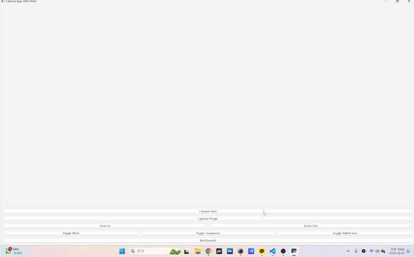
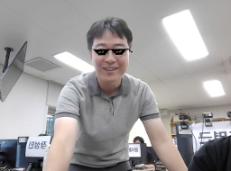

알겠습니다! 요청하신 대로 프로젝트 제목부터 시작하여 각 부분을 차례대로 자세히 설명하겠습니다.

---

### 프로젝트 제목: **실시간 얼굴 필터링 애플리케이션**

### 1. 프로젝트 목적
이 프로젝트는 **실시간 얼굴 필터링** 애플리케이션으로, 사용자의 얼굴을 웹캠으로 실시간으로 추적하고, 그 위에 다양한 필터를 적용하여 사용자에게 재미있고 실용적인 기능을 제공합니다. 사용자는 이 애플리케이션을 통해 **선글라스, 귀, 마스크** 등의 필터를 얼굴에 자연스럽게 적용할 수 있으며, 이를 통해 새로운 방식으로 자신의 모습을 꾸미고 즐길 수 있습니다.

### 2. 사용된 기술
이 프로젝트는 **OpenCV**, **MediaPipe**, **Numpy**와 같은 다양한 기술을 활용하여 얼굴 인식 및 필터 적용을 구현했습니다. 각 기술을 선택한 이유는 다음과 같습니다:

- #### 2.1 **OpenCV**
  **OpenCV**는 이미지 및 영상 처리에 널리 사용되는 라이브러리입니다. 이 프로젝트에서는 **웹캠 영상 캡처**, **영상 처리**, **필터 적용** 등을 처리하는 데 사용되었습니다. OpenCV는 실시간 영상 처리에 매우 효율적이고, 다양한 이미지 변환 및 필터링 기능을 제공하기 때문에 선택되었습니다.

- #### 2.2 **MediaPipe**
  **MediaPipe**는 **구글**에서 개발한 **컴퓨터 비전** 라이브러리로, 얼굴 인식 및 랜드마크 추출에 특화되어 있습니다. 이 프로젝트에서는 **FaceMesh**를 사용하여 실시간으로 얼굴의 랜드마크를 추출하고, 이 정보를 바탕으로 얼굴에 필터를 자연스럽게 적용했습니다. MediaPipe는 높은 정확도와 성능을 제공하기 때문에 이 프로젝트에서 얼굴 인식에 적합한 라이브러리로 선택되었습니다.

- #### 2.3 **Numpy**
  **Numpy**는 배열 및 행렬 연산을 효율적으로 처리하는 파이썬 라이브러리입니다. 얼굴 필터를 적용할 때 **회전**, **크기 조정** 등 수학적인 변환이 필요하고, 이러한 연산을 효율적으로 처리하기 위해 **Numpy**를 사용했습니다.

- #### 2.4 **Pyside**
  **PySide**는 **Qt** 프레임워크를 Python에서 사용할 수 있도록 만든 라이브러리로, **GUI 애플리케이션**을 만들 때 강력한 도구를 제공합니다. Qt는 **크로스 플랫폼** 개발을 지원하며, 복잡한 GUI를 손쉽게 구축할 수 있도록 다양한 위젯을 제공합니다.

---

### 3. GUI 설명
이 프로젝트의 GUI는 사용자가 실시간으로 얼굴 필터를 확인하고 선택할 수 있도록 구성되었습니다. 웹캠에서 촬영한 영상을 화면에 출력하고, 사용자가 키보드를 통해 필터 모드를 전환할 수 있도록 하였습니다.
<p align = "center">

</p>

- #### 3.1 **필터 모드 전환**
  프로그램은 **4가지 모드**로 구성되어 있습니다:
  - **No Filter**: 필터가 적용되지 않은 원본 영상
  - **Face Detection**: 얼굴을 인식하는 모드
  - **Face Mesh**: 얼굴 랜드마크를 그리는 모드
  - **Replace Background**: 얼굴을 검은색으로 만들고 배경을 다른 이미지로 교체하는 모드

  사용자는 **Q 키**를 눌러 모드를 변경할 수 있으며, **ESC 키**를 눌러 프로그램을 종료할 수 있습니다.

아래는 주어진 양식에 맞춰서 **선글라스**, **토끼 귀**, **마스크**, **블러 처리** 필터에 대한 설명과 코드, 추가 설명을 포함하여 작성한 내용입니다.

---

### 4. 필터 적용 (선글라스, 토끼 귀, 마스크, 블러 처리)

이 프로젝트에서는 **선글라스**, **토끼 귀**, **마스크** 필터 외에도 **배경 교체**와 같은 다양한 기능을 제공합니다. 아래에서 각 필터의 적용 방법을 자세히 설명하겠습니다.


#### 4.1 **선글라스 필터**
**선글라스 필터**는 사용자의 얼굴에 자연스럽게 선글라스를 추가하는 기능입니다. 이 필터는 **두 눈의 중심**을 기준으로 선글라스를 위치시키고, **회전 각도**를 계산하여 선글라스가 정확하게 눈에 맞게 배치됩니다. 또한, 선글라스 이미지는 투명 PNG 형식으로 사용되어 배경과 잘 결합됩니다.
<p align="center">
  
</p>

- **눈의 위치**를 추적하고, 그에 맞춰 **회전** 및 **크기 조정**하여 선글라스를 적용합니다.
---

### **선글라스 적용 과정**:
1. **각도 계산**: `arctan2`와 `np.degrees`를 사용해 두 눈의 위치로 얼굴 기울기 각도를 계산합니다.
2. **선글라스 회전**: `getRotationMatrix2D`로 회전 행렬을 만들고, `warpAffine`로 이미지를 회전시켜 얼굴 각도에 맞게 선글라스를 회전시킵니다.
3. **눈 위치 추적**: `get_eye_center`로 두 눈의 중심 좌표를 얻고, 선글라스를 그 위치에 배치합니다.
4. **크기 조정**: 눈 사이의 거리에 맞춰 선글라스를 조정하여 적절한 크기로 설정합니다.
5. **합성**: 투명 PNG 형식으로 선글라스를 원본 이미지에 합성하여 자연스럽게 적용합니다.

---

#### 4.2 **토끼 귀 필터**
**토끼 귀** 필터는 사용자의 머리 위에 귀 모양의 이미지를 추가하는 기능입니다. 이 필터의 동작 방식은 **얼굴의 크기와 위치**를 기반으로 귀 이미지가 자연스럽게 사용자 머리 위에 배치되도록 합니다.

<p align= "center">
  
</p>

---
**토끼 귀 필터 적용 과정**:
1. **얼굴의 상단 위치**를 추적하여 귀 이미지를 머리 위에 정확히 배치합니다.
2. **귀 이미지의 크기**는 사용자의 얼굴 크기에 맞춰 동적으로 조정됩니다.
3. **귀 이미지를 배치**하여 사용자의 머리 위에 자연스럽게 올려 놓습니다.

---

#### 4.3 **얼굴 홍조 (Blush)**

**얼굴 홍조 필터**는 사용자의 얼굴에 **발그레한 효과**를 추가하는 기능입니다. 이 필터는 사용자의 **왼쪽과 오른쪽 뺨** 부위의 랜드마크를 기준으로, 해당 위치에 **붉은색의 원형 효과**를 적용하여 자연스러운 홍조 효과를 만들어냅니다. 이 과정은 **알파 채널을 이용한 블렌딩**과 **가우시안 블러** 처리를 통해 부드럽고 자연스러운 결과를 제공합니다.

<p align = "center">

</p>

**얼굴 홍조 적용 과정**:
1. **왼쪽과 오른쪽 뺨의 위치 추적**: `MediaPipe`에서 제공되는 얼굴 랜드마크를 사용하여 **왼쪽 뺨**(50번 인덱스)과 **오른쪽 뺨**(280번 인덱스) 위치를 추적합니다.
2. **발그레 효과 추가**: 추적된 뺨의 위치에 **붉은색 원형 영역**을 추가하고, 이를 **가우시안 블러**를 사용하여 자연스럽게 섞어줍니다.
3. **알파 채널을 이용한 블렌딩**: `cv2.addWeighted()` 함수를 사용하여 얼굴 원본 이미지에 홍조 효과를 자연스럽게 합성합니다.
---

위 코드와 설명은 **홍조** 효과를 얼굴에 자연스럽게 추가하는 방법을 보여주고 있습니다. 이를 통해 사용자는 이미지에서 얼굴에 자연스러운 **발그레한 느낌**을 추가할 수 있습니다.

---

이와 같이 각 필터는 사용자 얼굴에 자연스럽게 추가되며, **정확한 위치 추적**과 **동적 크기 조정**을 통해 매우 효과적으로 기능을 구현할 수 있습니다.

---

### 결론
이 프로젝트는 다양한 **필터** 기능을 통해 사용자가 실시간으로 재미있고 창의적인 효과를 얼굴에 적용할 수 있도록 도와줍니다. **선글라스**, **토끼 귀**, **마스크**, **배경 블러 처리** 등을 포함한 필터들은 **얼굴 랜드마크**를 기반으로 동적으로 크기 조정 및 위치를 계산하여 자연스럽게 배치됩니다.

이러한 기능들은 사용자의 얼굴을 인식하고 그에 맞는 필터를 실시간으로 적용하는 데 중점을 두고 개발되었습니다.

---

```bash
pip install opencv-python mediapipe PySide6 numpy
```
## 파일 구조
```
CameraApp/
├── config/
│   ├── AppConfig.py
│   ├── paths.py
├── filters.py
├── sendver.py
└── README.md
```
## [2조 프레젠테이션](https://www.canva.com/design/DAGbkgoJI88/cyTmFZsjsnX92b40vEZwhw/edit?utm_content=DAGbkgoJI88&utm_campaign=designshare&utm_medium=link2&utm_source=sharebutton)
## [시연 영상](https://drive.google.com/file/d/13Olggws0CN2cgvkmCZlPBrFkPXdw3Itt/view?usp=sharing)
